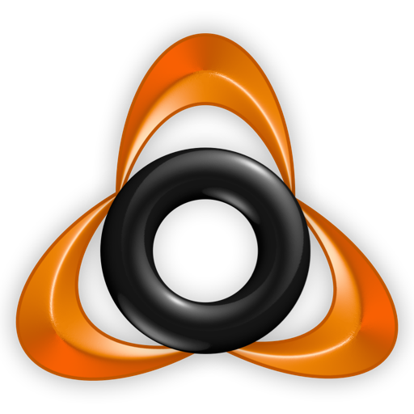

Title: iCanScript Readme
Version: v1.2.8

# iCanScript Readme - v1.2.8

## Installation
Use the following steps to install iCanScript:

1. Save the attached files on your hard drive;
2. Open the Unity game engine.
3. Delete the iCanScript folder from your project panel if it already exists;
4. Install iCanScript using one of the following:
5. Use _**Assets->Import Package->Custom Package**_ to import the iCanScript package you have saved on your hard drive;
5. Create a game object of your choice;
6. Attach an iCanScript visual script component (from the _**Component->iCanScript->Visual Script**_ menu) to your game object;
7. You are now ready to create your first visual script program…

This version has been tested on OSX and Windows 7 & Windows 10.  Disruptive software provides the software as-is and is not responsible for issues associated with it's usage.

## Space Shooter Tutorial
The popular Unity Space Shooter tutorial was recreated using iCanScript.

Use the following links to download the Space Shooter project and watch the video tutorials:

- [Space Shooter Package][]
- [Space Shooter Video Tutorials][]

## Environment Setup ##

After installing iCanScript, you will be able to open its 4 main editors from the _**Window | iCanScript**_ menu of Unity.

- The _**Visual Editor**_;
- The _**Library Tree**_;
- The _**Hierarchy Tree**_;
- The _**Instance Wizard**_.

Follow these steps to create a _Visual Script_:

1. Select a _GameObject_ in the _Scene_ to host the _Visual Script_;
2. Use the _**Component | iCanScript | Visual Script**_ menu item to add the visual script;
3. Right click in the _Visual Editor_ to display the list of available _Message Handlers_;
4. Select the desired _Message Handler_ and populate it with nodes from the library.

You can quickly populate the visual graph using one of the following:

- Drag a GameObject from the Unity hierarchy panel into the visual editor;
- Search for pre-existing components in the iCanScript library panel and drag the desired node into the visual editor;
- Drag a port inside the visual editor to create a node with the basic type of the node.
	
## iCanScript Package
The iCanScript unity package can be imported in your project as a custom package.  It will automatically create a Gizmos folder and install the _iCanScriptGizmo.png_ graphic file the first time you launch the visual editor.  The Gizmo is used to show the GameObjects that include a visual script in the Scene view.

The iCanScript package includes several files and most should not be modified as they will change in future releases of iCanScript. The user that wants to extend the iCanScript library  with his/her own library or source code will find useful to brows through the following folders:

- **iCanScript/Editor/NodeInstaller:**  This folder includes the built-in Unity & .NET node installer files.  It also includes the _iCS_CustomInstaller_ file you can modify to invoke your own node installer (see [Installing Your Own Library][]).
- **iCanScript/Engine/Nodes:**  This folder includes the source code for the built-in nodes.  Use can use these files as examples to create your own node from source code.

Additional details for extending the iCanScript library can be found in the [Extending iCanScript][] section of the [Help Desk].

## Demo Scenes

### Space Shooter demo
The Unity _Space Shooter_ tutorial has been implemented with iCanScript.  You can find the project on the [Download Page][] of iCanScript.

### Other demos
The iCanScript package includes a Playground demo scene that can be open from:

- _"iCanScript/Demo_Scenes/Playground"_

## Getting the Latest Version
iCanScript periodically verifies for product updates. The verification interval can be modified from the iCanScript Preferences Panel.

You can also manually verification for new version of iCanScript using the following menu item:

- _"iCanScript->Check for Updates..."_

## Installing Your Own Library
You can install your own libraries to be used in iCanScript.  To do so, you can customize the file _"iCanScript/Editor/NodeInstaller/CustomInstaller.cs"_ to invoke your own installer.

The Unity & .NET nodes are installed in the following files:

- _"iCanScript/Editor/NodeInstaller/iCSUnityClasses.cs"_ and;
- _"iCanScript/Editor/NodeInstaller/iCSNETClasses.cs"_.

The Unity and .NET node installer files **SHOULD NOT BE MODIFIED** as they will most likely evolve in future releases of iCanScript.  However, you are invited to browse those files and use them as examples to populate the iCanScript library with nodes extracted from existing libraries.

## Creating Nodes from Your Source Code
iCanScript offers the ability to directly publish your code as node(s).  This is realize by tagging your classes, attribute, properties, and functions using iCanScript metadata attributes.  You can find more information on the iCanScript attributes in the [Help Desk Knowledge Base][] in section [Extending iCanScript][].

## Documentation
The User Guide for iCanScript is embedded inside the iCanScript package and can be accessed from the root folder of iCanScript once it is installed.  The [User Guide][] can also be access from the iCanScript web site.

Major sections of the user and programmer documentation are still work in progress.  Please excuse us for the delay.

Enjoy and help us make iCanScript better by submitting customer request for bugs and new features.

[User Guide]: http://icanscript.com/support?view=kb
[Extending iCanScript]: http://icanscript.com/support?view=kb
[Help Desk]: http://www.icanscript.com/support
[Help Desk Knowledge Base]: http://www.icanscript.com/support
[Download Page]: http://icanscript.com/learn2/space-shooter-tutorial
[Space Shooter Package]: http://icanscript.com/learn2/space-shooter-tutorial
[Space Shooter Video Tutorials]: http://icanscript.com/learn2/space-shooter-tutorial